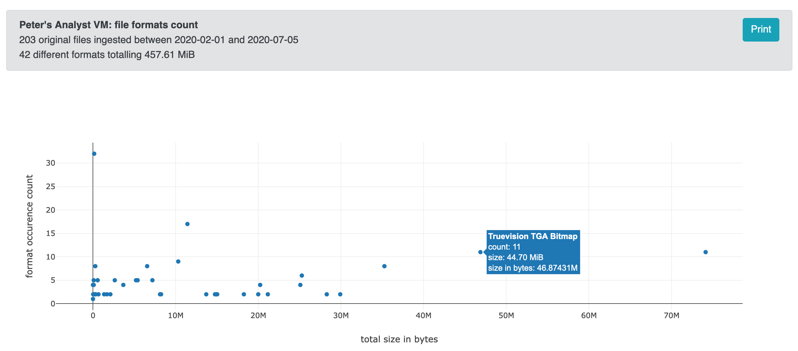

# AIPscan

Collect repository-wide info about [Archivematica][am-1] Archival
Information Packages (AIPs)

## License

Copyright Artefactual Systems Inc (2020).
[Apache License Version 2.0](LICENSE)

## Installation

### AIPScan Flask server

* Clone files and cd to directory:  `git clone https://github.com/peterVG/AIPscan && cd AIPscan`
* Set up virtualenv in the project root directory: `virtualenv venv`
* Activate virtualenv: `source venv/bin/activate`
* Install requirements (this includes Flask & Celery): `pip install -r requirements.txt`
* Enable DEBUG mode if desired for development: `export FLASK_CONFIG=dev`
* In a terminal window, start the Flask server: `python run.py`

### RabbitMQ

RabbitMQ acts as a queue manager so that work is queued and then actioned as
needed. There are two options to running RabbitMQ at present:

#### Path of least resistance (Docker)

* With docker installed, run the following command:

  ```bash
  sudo docker run --rm \
    -it \
    --hostname my-rabbit \
    -p 15672:15672 \
    -p 5672:5672 rabbitmq:3-management
  ```

* RabbitMQ's server will be visible at [`http://localhost:15672/`][rabbit-MQ2]
and AIPScan will automatically be able to connect to the queue at `:5672`.

#### Download to run...

* Download and install RabbitMQ queue manager: [Download Link][rabbit-MQ1]
* In another terminal window, start RabbitMQ queue manager:

  ```bash
  export PATH=$PATH:/usr/local/sbin
  sudo rabbitmq-server
  ```

* To see RabbitMQ dashboard visit: [`http://localhost:15672/`][rabbit-MQ2]
* The user name will be `guest` and password `guest`.

### Celery

* In another terminal window, from the AIPscan root directory, start a Celery
worker: `celery worker -A AIPscan.worker.celery --loglevel=info`

## Usage

### Connecting to a storage service and initiating AIPScan's use

* Go to [`localhost:5000`][usage-1] in a browser.
* Select "New Storage Service"
* Add an Archivematica Storage Service record, including API Key, eg.
`https://amdemo.artefactual.com:8000`
* Select "New Fetch Job"
* When the Fetch Job completes, select "View AIPs" button, "AIPs" menu, or
"Reports" menu.

## Screenshots

### Example AIPScan fetch job


### Viewing an AIP in AIPScan


### Selecting a report to run in AIPScan


### Demonstration of a scatter chart report



[am-1]: https://archivematica.org
[rabbit-MQ1]: https://www.rabbitmq.com/download.html
[rabbit-MQ2]: http://localhost:15672/
[usage-1]: http://localhost:5000
