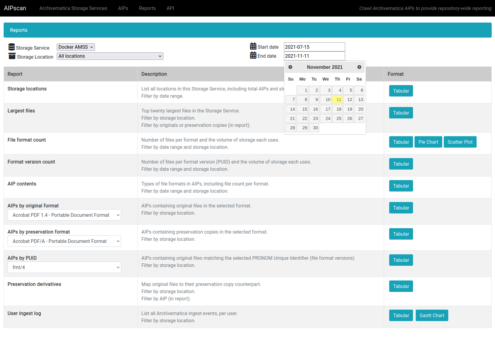

# AIPscan

By [Artefactual]

[![PyPI version][badge-pypi]][pypi-release]
[![GitHub CI][badge-ci]][test-workflow]
[![codecov][badge-codecov]][codecov-report]

AIPscan provides an in-depth reporting solution for Archivematica users. It
crawls METS files from AIPs in the Archivematica Storage Service to generate
tabular and visual reports about repository holdings. It is designed to run as a
stand-alone add-on to Archivematica and requires only a valid Storage Service
API key to fetch source data.

You are free to copy, modify, and distribute AIPscan, with attribution, under
the terms of the Apache License, version 2.0. See the [LICENSE] file for
details.

## Screenshots

### AIPscan fetch job

### Finding an AIP

### Viewing an AIP

### Selecting a report

### Example: pie chart "format types" report

### Example: tabular "largest files" report

## Installation

AIPscan is a web-based application that is built using the Python [Flask]
micro-framework. See [INSTALL.md] for production deployment instructions. See
[CONTRIBUTING.md] for guidelines on how to contribute to the project, including
how to set up the development environment and create a new AIPscan report.

## Contributing

See [CONTRIBUTING.md] for full contribution guidelines and
development environment setup instructions.

## Usage

Consult [USAGE.md] for a walkthrough of the web workflow and the helper scripts
in the `tools` directory. It covers verifying your deployment, running fetch
jobs, and seeding test data.

[badge-pypi]: https://badge.fury.io/py/aipscan.svg
[pypi-release]: https://badge.fury.io/py/aipscan
[badge-ci]: https://github.com/artefactual-labs/AIPscan/actions/workflows/test.yml/badge.svg
[test-workflow]: https://github.com/artefactual-labs/AIPscan/actions/workflows/test.yml
[badge-codecov]: https://codecov.io/gh/artefactual-labs/AIPscan/branch/main/graph/badge.svg
[codecov-report]: https://codecov.io/gh/artefactual-labs/AIPscan
[Artefactual]: https://www.artefactual.com/
[Flask]: https://pypi.org/project/Flask/
[LICENSE]: LICENSE
[INSTALL.md]: INSTALL.md
[CONTRIBUTING.md]: CONTRIBUTING.md
[USAGE.md]: USAGE.md
